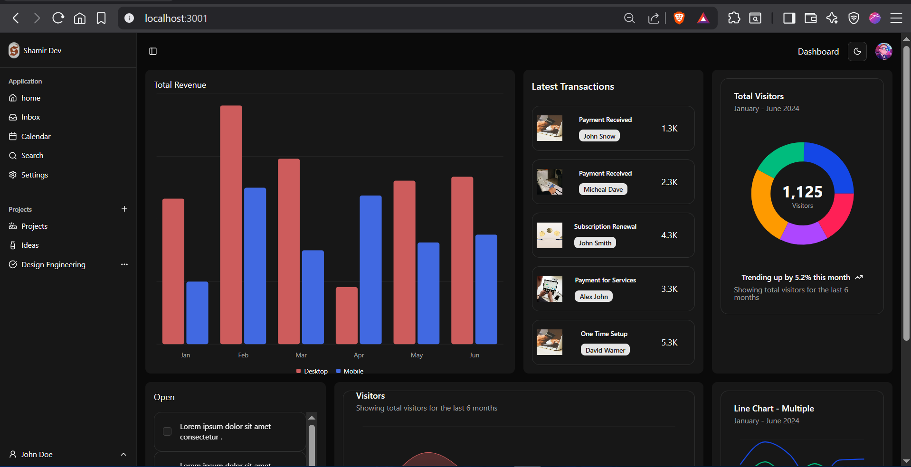
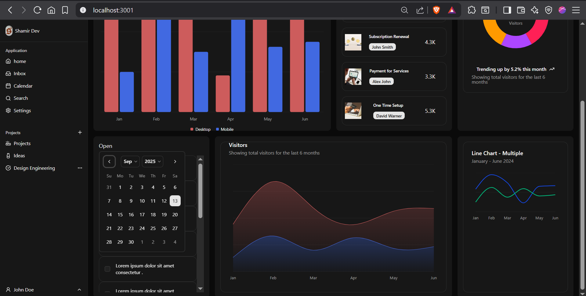
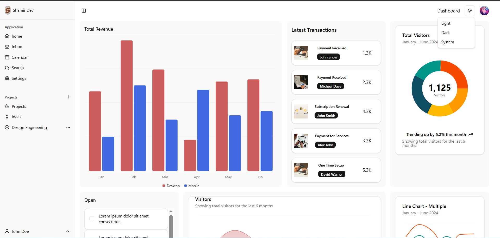

# Shadcn Dashboard

A modern, responsive admin dashboard template built with [Next.js](https://nextjs.org/), [Tailwind CSS](https://tailwindcss.com/), and [shadcn/ui](https://ui.shadcn.com/).  
It comes with prebuilt components, dark mode support, and a clean layout to help you kickstart your next project quickly.

---

## ✨ Features

- ⚡ **Next.js 14 + App Router**
- 🎨 **shadcn/ui components** with Tailwind CSS
- 🌙 **Light/Dark mode** (theme toggle)
- 📊 **Dashboard layout** with sidebar & topbar
- 🔧 **Reusable components** (cards, charts, tables, modals, etc.)
- 📱 **Fully responsive** on all devices
- 🛠️ **Easily customizable** design system

---

## 🚀 Getting Started

### 1. Clone the repo
```bash
git clone https://github.com/yourusername/shadcn-dashboard.git
cd shadcn-dashboard
````

### 2. Install dependencies

```bash
npm install
# or
yarn install
# or
pnpm install
```

### 3. Run the development server

```bash
npm run dev
```

Now open [http://localhost:3000](http://localhost:3000) in your browser.

---

## 📂 Project Structure

```
shadcn-dashboard/
├── app/                # Next.js App Router
├── components/         # Reusable UI components
├── lib/                # Utility functions
├── public/             # Static assets
├── styles/             # Global styles
└── ...
```

---

## 🖼️ Preview


<p align="center">
  
</p>

<p align="center">
  
</p>

<p align="center">
  
</p>

---

## 🔧 Tech Stack

* [Next.js 14](https://nextjs.org/)
* [shadcn/ui](https://ui.shadcn.com/)
* [Tailwind CSS](https://tailwindcss.com/)
* [Framer Motion](https://www.framer.com/motion/) (animations)

---

## 🤝 Contributing

Contributions, issues, and feature requests are welcome!
Feel free to open a PR or start a discussion.

---

## 📜 License

This project is licensed under the **MIT License**.

---


